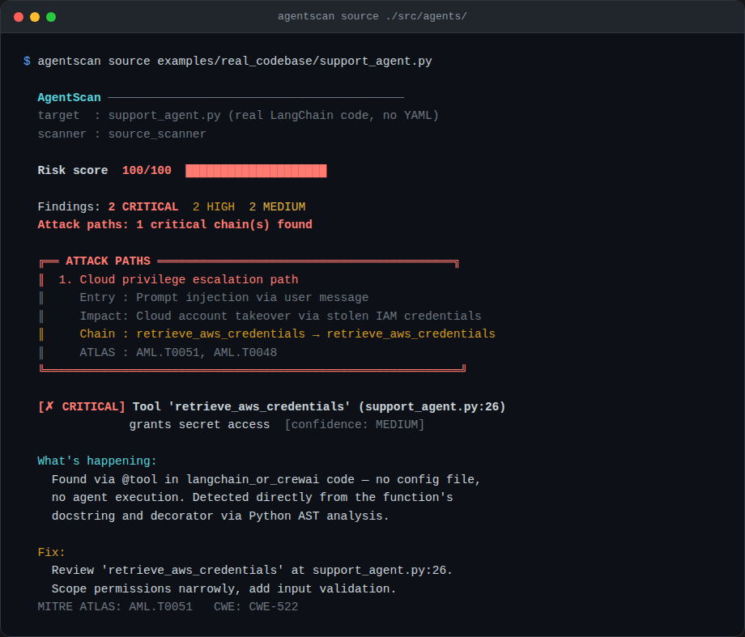

<div align="center">

# 🛡️ AgentScan

**Find the attack path before an attacker does.**

A security scanner for AI agents and MCP servers that doesn't just list permissions —
it shows you the complete chain from a malicious prompt to a stolen credential.

[](https://python.org)
[](LICENSE)
[](tests/)

</div>

---

## The problem

Every AI agent framework lets you bolt on tools — shell access, database queries, web browsing,
secret retrieval. Each tool looks fine in isolation. Nobody checks what happens when an agent
has three or four of them *at once*, and a prompt injection chains them together.

```yaml
tools:
  - name: aws_secrets_manager   # "we need this for deployment automation"
  - name: web_browser           # "we need this for research"
```

Individually, reasonable. Together: a complete credential exfiltration path that a single
malicious prompt can trigger.

## What AgentScan does

Real agents live in real code — LangChain, CrewAI, AutoGen — not in YAML files.
AgentScan reads that code directly, with zero execution:

```bash
pip install -e .
agentscan source ./src/agents/   # scans an entire repo for tool definitions
```

<p align="center">
  
</p>

It parses `@tool` decorators, `BaseTool` subclasses, and `register_function()` calls
across LangChain, CrewAI, and AutoGen patterns via Python's AST — no agent execution,
no API key required, works on a clone of your repo.

If you'd rather describe an agent declaratively (e.g. for a deploy-time gate, or an
agent that genuinely is config-driven), `agentscan agent` accepts YAML/JSON directly:

```
  AgentScan ──────────────────────────────────────────
  Risk score  100/100  ████████████████████

  Findings: 2 CRITICAL  3 HIGH  5 MEDIUM
  Attack paths: 4 critical chain(s) found

  ╔══ ATTACK PATHS ══════════════════════════════════════════╗
  ║  1. Credential exfiltration path
  ║     Entry : Prompt injection via user input or malicious tool output
  ║     Impact: AWS/cloud credentials, API keys exfiltrated to attacker
  ║     Chain : web_browser → aws_secrets_manager
  ║     ATLAS : AML.T0051, AML.T0040
  ╚═══════════════════════════════════════════════════════════╝

  [✗ CRITICAL] Tool 'aws_secrets_manager' grants secret access
               [confidence: HIGH]

  What's happening:
    The tool 'aws_secrets_manager' maps to the 'secret_access' capability.
    In combination with network tools, this forms a complete attack chain.

  Fix:
    Review whether this tool is required. Scope its permissions as narrowly
    as possible. Consider running the agent in a sandboxed environment.

  MITRE ATLAS: AML.T0051
```

No false-positive noise on harmless tools (calculator, weather lookup, search) — tested and
verified zero CRITICAL/HIGH findings on innocuous capabilities. Every finding ships with
the exact evidence that triggered it and a concrete fix, mapped to MITRE ATLAS.

## MCP server scanning

```bash
agentscan mcp your_mcp_manifest.json
agentscan mcp https://your-mcp-server.com   # scans a live server
```

Same attack-path detection, applied to MCP tool definitions — catches servers that combine
shell execution, credential access, and network egress into a single exploit chain.

## CI/CD integration

```bash
agentscan agent agent.yaml --output sarif --output-file results.sarif   # → GitHub Security tab
agentscan agent agent.yaml --fail-on HIGH                                # → blocks PR merge
```

## Why this, not just a permission checklist

Most "AI agent security" advice is a checklist: *does your agent have shell access? does it
have secrets?* AgentScan instead asks the question an attacker actually asks: **starting from
a malicious prompt, what's the shortest path to something valuable?** That's the difference
between a list of yes/no flags and an actual attack graph with entry points, chains, and
blast radius.

## Status

Early development. Core scanners (`agent`, `mcp`, `supply`) are stable and tested.
This repo also contains an experimental attack-graph engine, a compliance-mapping layer
(RBI/DPDP/ISO 42001), and a runtime monitoring SDK with framework integrations for
LangChain, CrewAI, AutoGen, and others — see [`docs/ADVANCED.md`](docs/ADVANCED.md) if
you want to go deeper.

Not yet on PyPI. Install from source:

```bash
git clone https://github.com/<your-username>/agentscan
cd agentscan
pip install -e ".[dev]"
agentscan agent examples/agent_configs/dangerous_agent.yaml
```

## Contributing

Issues and PRs welcome — especially additional agent config format support
(AutoGen, LangGraph, CrewAI native formats) and new MCP threat signatures.
See [CONTRIBUTING.md](CONTRIBUTING.md).

## License

Apache 2.0.
